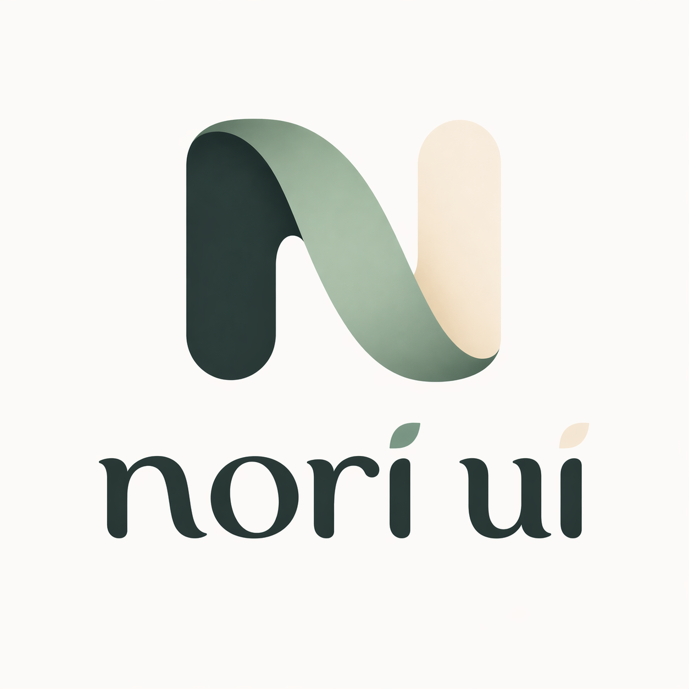

<p align="center">
  
</p>

<h1 align="center">nori-ui</h1>

<p align="center">
  A React Native + Web UI component library.<br />
  Expo-first, New Architecture, styled with NativeWind v4, themed via Figma design tokens.
</p>

---

## Status

**Pre-v0.1 — under active development.** See `docs/superpowers/specs/2026-04-22-nori-ui-design.md` for the full PRD and `docs/superpowers/plans/` for implementation plans.

## Quick reference

| Concern | Tool |
|---|---|
| Runtime target | Expo SDK 55 (React Native 0.83, React 19) |
| Node | >= 20 |
| Package manager | Yarn 4 (Berry), `nodeLinker: node-modules` |
| Lint / format | Biome (primary) + ESLint with `eslint-plugin-react-native` (transitional) |
| Styling | NativeWind v4 |
| Testing | Jest + `@testing-library/react-native`, Playwright (web e2e), Maestro (native e2e) |
| Docs | Fumadocs (Next.js App Router) |
| Release | `semantic-release` with npm OIDC trusted publisher |

## Developing

```bash
corepack enable
yarn install
yarn typecheck
yarn lint
yarn test
yarn size
```

Start the playgrounds:

```bash
yarn dev:web       # Vite + react-native-web at http://localhost:5173
yarn dev:native    # Expo at http://localhost:8081
yarn dev:docs      # Fumadocs at http://localhost:3000
yarn dev:storybook # Storybook at http://localhost:6006
```

## Support window

Rolling 3 Expo SDK tiers: current, maintained, legacy. Anchor: SDK 55. See `docs/superpowers/specs/` for the full policy.

## Contributing

Conventional Commits are enforced via commitlint + lefthook. Run `yarn install` once to set up hooks locally.

## License

MIT.
